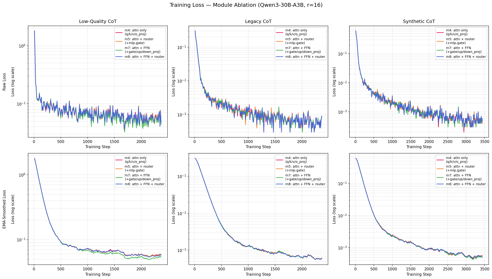
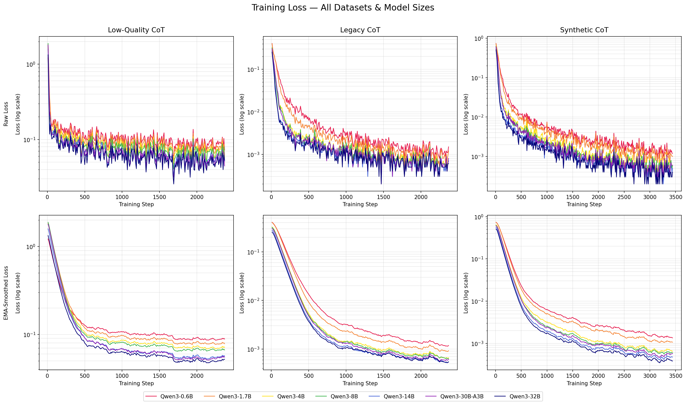

# 实验结果记录

## 0. 实验概览

| 阶段 | 描述 |
|---|---|
| 零样本推理 | 5 个模型直接推理，无微调 |
| LoRA 数据对比 | 统一框架，对比 legacy / synthetic / low-quality 三组数据 |
| 超参数搜索 | legacy CoT 数据，搜索 max_length / batch / lr / r-alpha |
| 微调模块消融 | 对比 m4/m5/m7/m8 四种 target_modules 配置 × 三组数据 |
| 多尺寸实验 | 7 个 Qwen3 模型 × 4 组训练集（含 zeroshot） |

评估集：`current_950`，共 950 题。

## 1. 实验设置

所有实验统一推理与评分参数：

| 参数 | 取值 |
|---|---|
| 基础模型 | Qwen3-30B-A3B（`./models/Qwen3-30B-A3B`） |
| vLLM max_model_len | 8,192 |
| vLLM gpu_memory_utilization | 0.85 |
| vLLM max_lora_rank | 32 |
| temperature / top_p | 0.0 / 1.0 |
| max_tokens（生成上限） | 7,680 |
| thinking 模式 | 启用（`enable_thinking=True`） |
| 提示后缀 | `Please put your final answer inside \boxed{}. For example: \boxed{your answer}` |
| 答案抽取 | 优先 `\boxed{}`，兜底 `Final answer:`，最后落到末行 |
| 评分 | 01 串严格比 / 数值 1e-2 相对容忍 / 大小写不敏感字符串比 |

零样本实验使用基础模型直接推理，推理参数 `max_tokens=32768`，详见第二节。

## 2. 零样本推理

### 2.1 推理配置

| 参数 | 取值 |
|---|---|
| 微调 | 无 |
| temperature / top_p | 0.0 / 1.0 |
| max_tokens | 32,768 |
| max_model_len | 32,768（Kimi 系列使用 37,760，满足 hybrid attention page-size 约束） |
| thinking 模式 | 启用 |

### 2.2 各模型 current_950 结果

| 类别 | Qwen3-30B-A3B | Qwen3-4B | Nemotron-30B-A3B | Kimi-48B-Instruct | Kimi-48B-Base |
|---|---:|---:|---:|---:|---:|
| bit_manipulation | 26.2% (42/160) | 16.2% (26/160) | 25.0% (40/160) | 4.4% (7/160) | 6.9% (11/160) |
| cipher | 42.7% (67/157) | 4.5% (7/157) | 53.5% (84/157) | 1.9% (3/157) | 0.0% (0/157) |
| cryptarithm_deduce | 3.0% (2/66) | 0.0% (0/66) | 0.0% (0/66)† | 0.0% (0/66) | 0.0% (0/66) |
| cryptarithm_guess | 0.0% (0/16) | 0.0% (0/16) | 0.0% (0/16)† | 0.0% (0/16) | 0.0% (0/16) |
| equation_numeric_deduce | 53.3% (32/60) | 41.7% (25/60) | 45.0% (27/60) | 8.3% (5/60) | 15.0% (9/60) |
| equation_numeric_guess | 7.1% (1/14) | 7.1% (1/14) | 0.0% (0/14)† | 0.0% (0/14) | 0.0% (0/14) |
| gravity | 99.4% (159/160) | 99.4% (159/160) | 74.4% (119/160) | 6.9% (11/160) | 75.6% (121/160) |
| numeral | 100.0% (158/158) | 82.9% (131/158) | 100.0% (158/158) | 88.0% (139/158) | 75.9% (120/158) |
| unit_conversion | 100.0% (159/159) | 95.0% (151/159) | 86.8% (138/159) | 15.1% (24/159) | 35.8% (57/159) |
| **TOTAL** | **65.3% (620/950)** | **52.6% (500/950)** | **59.6% (566/950)** | **19.9% (189/950)** | **33.5% (318/950)** |

† Nemotron 的 cryptarithm / equation_guess 类别受 `finish_reason=length` 截断影响显著：
cryptarithm_guess 截断率 100%，cryptarithm_deduce 97%，bit_manipulation 64%，
平均生成 13,225 tokens/题（Qwen3 约 12,879）。Kimi-Instruct 截断率更高达 71.5%（679/950 题）。

## 3. LoRA 数据对比

训练框架：Transformers Trainer + Unsloth 模型补丁（`scripts/train.py` + `src/training/runner.py`）。
评估日期：2026-08-11。设备：NVIDIA H200 单卡。

### 3.1 运行配置

三组实验使用统一的训练、推理和评分流程；完整复现命令见 `docs/reproduction.md`。

数据构建命令：

```bash
python scripts/build_data.py --config configs/data/legacy.yaml
python scripts/build_data.py --config configs/data/synthetic_pilot.yaml
python scripts/build_low_quality_cot_csv.py \
  --input-csv data/train.csv \
  --output-csv data/train_split_low_quality_cot.csv
python scripts/build_data.py --config configs/data/low_quality.yaml
```

训练配置文件：

| 实验组 | 配置文件 | 训练 JSONL | Adapter 输出目录 |
|---|---|---|---|
| Legacy CoT | `configs/training/legacy.yaml` | `outputs/data/legacy/qwen_traces.jsonl` | `outputs/adapters/legacy-cot-transformers` |
| Synthetic pilot | `configs/training/synthetic.yaml` | `outputs/data/synthetic_pilot/qwen_traces.jsonl` | `outputs/adapters/synthetic-cot-transformers` |
| Low-quality CoT | `configs/training/low_quality.yaml` | `outputs/data/low_quality/qwen_traces.jsonl` | `outputs/adapters/low-quality-cot-transformers` |

评估统一使用 `configs/eval/current_950.yaml`，并通过 `scripts/infer.py` 和 `scripts/score.py` 分别完成推理和评分。

### 3.2 共享训练配置

| 参数 | 取值 |
|---|---|
| 基础模型 | Qwen3-30B-A3B（`./models/Qwen3-30B-A3B`） |
| LoRA r / alpha / dropout | 16 / 32 / 0.0 |
| LoRA target_modules | q_proj, k_proj, v_proj, o_proj（4 个，仅保留 attention projection 模块） |
| max_seq_length | 8,192 |
| per_device_batch × grad_accum | 1 × 4（eff_batch=4） |
| learning_rate | 2e-4 → 1e-5（cosine_with_min_lr） |
| 训练轮数 | 1 |
| max_grad_norm | 1e9 |
| 精度 | bfloat16 |
| packing | 禁用 |
| completion-only labels | 是 |
| seed | 123 |

### 3.3 训练数据对比

| | legacy-cot | synthetic-cot | low-quality-cot |
|---|---|---|---|
| 文件 | data/train_split_with_cot.csv | 由 `build_data.py` 生成 | data/train_split_low_quality_cot.csv |
| 来源 | 竞赛官方训练集 CoT | Nemotron 生成器 + 求解器验证 | 模板填充假 CoT（消融对照） |
| 行数 | 9,500 | 13,794 | 9,500 |
| CoT 质量 | external_unverified | solver_verified | template_fabricated |
| 平均 tokens / 平均 loss tokens | 3,442 / 3,299 | 3,480 / 3,328 | 202 / 59 |
| 训练步数 | 2,375 | 3,449 | 2,375 |
| 训练时长 | 6.26 h | 8.53 h | 2.89 h |

**合成数据生成统计：**

| 类别 | 生成数 | 验证通过 | 验证失败 |
|---|---:|---:|---:|
| bit_manipulation | 4,000 | 3,942 | 58 |
| equation_transform/numeric | 4,000 | 3,568 | 432 |
| equation_transform/symbol | 4,000 | 2,784 | 1,216 |
| text_cipher | 2,000 | 2,000 | 0 |
| physics_gravity | 500 | 500 | 0 |
| unit_conversion | 500 | 500 | 0 |
| roman_numeral | 500 | 500 | 0 |
| **合计** | **15,500** | **13,794** | **1,706** |


**Legacy CoT token 长度分布（Qwen3-30B-A3B tokenizer，9,500 条完整 SFT 序列）：**


### 3.4 current_950 结果

| 类别 | legacy-cot | synthetic-cot | low-quality-cot |
|---|---:|---:|---:|
| bit_manipulation | 80.6% (129/160) | **96.9% (155/160)** | 41.9% (67/160) |
| cipher | 100.0% (157/157) | 100.0% (157/157) | 73.9% (116/157) |
| cryptarithm_deduce | 9.1% (6/66) | 12.1% (8/66) | 4.5% (3/66) |
| cryptarithm_guess | 0.0% (0/16) | **12.5% (2/16)** | 0.0% (0/16) |
| equation_numeric_deduce | 90.0% (54/60) | **100.0% (60/60)** | 51.7% (31/60) |
| equation_numeric_guess | 7.1% (1/14) | **50.0% (7/14)** | 14.3% (2/14) |
| gravity | 100.0% (160/160) | 100.0% (160/160) | 81.9% (131/160) |
| numeral | 100.0% (158/158) | 100.0% (158/158) | 100.0% (158/158) |
| unit_conversion | 100.0% (159/159) | 100.0% (159/159) | 100.0% (159/159) |
| **TOTAL** | **86.7% (824/950)** | **91.2% (866/950)** | **70.2% (667/950)** |

**结论**：
- synthetic CoT 比 legacy CoT 高 +4.5pp，核心提升来自 bit_manipulation（+16.3pp）和 equation_numeric_guess（+42.9pp）。
- low-quality CoT 消融确认 CoT 质量是关键因素：模板填充假推理直接下降 16.5pp。
- cryptarithm 两类（deduce + guess）在所有配置下均属短板，最高仅 12.5%，是后续改进的主要方向。

## 4. 超参数搜索

本节实验数据来源：`data/train_split_with_cot.csv`（legacy CoT，9,500 行）。
本节记录 legacy CoT 数据的超参数搜索结果；训练入口和框架同第三节。

### 4.1 共享基础配置

| 参数 | 取值 |
|---|---|
| 基础模型 | Qwen3-30B-A3B |
| 训练数据 | train_split_with_cot.csv（9,500 行，external_unverified CoT） |
| LoRA target_modules | q_proj, k_proj, v_proj, o_proj, gate_proj, up_proj, down_proj（7 个） |
| 精度 | bfloat16 |
| packing | 禁用 |
| completion-only labels | 是（prompt 和 padding 的 label 设为 −100） |
| Liger kernel | 启用 |
| 训练轮数 | 1 |
| max_grad_norm | 1e9 |
| 设备 | NVIDIA H200 单卡（lr 消融使用 B200） |

各消融实验的**默认值**（未变化的维度保持此值）：

| 参数 | 默认值 |
|---|---|
| max_length（训练截断） | 7,680 |
| eff_batch（per_device=1） | 8（gradient_accumulation=8） |
| learning_rate | 2e-4 |
| LoRA r / alpha | 32 / 32 |

### 4.2 max_length 消融

固定：eff_batch=8，lr=2e-4，r=32，alpha=32。

| 类别 | ml=4096 | ml=7680 | ml=8192 |
|---|---:|---:|---:|
| bit_manipulation | 0.0% (0/160) | 81.9% (131/160) | 80.0% (128/160) |
| cipher | 99.4% (156/157) | 99.4% (156/157) | 98.7% (155/157) |
| cryptarithm_deduce | 4.5% (3/66) | 6.1% (4/66) | 4.5% (3/66) |
| cryptarithm_guess | 0.0% (0/16) | 0.0% (0/16) | 0.0% (0/16) |
| equation_numeric_deduce | 13.3% (8/60) | 90.0% (54/60) | 88.3% (53/60) |
| equation_numeric_guess | 0.0% (0/14) | 7.1% (1/14) | 7.1% (1/14) |
| gravity | 100.0% (160/160) | 100.0% (160/160) | 100.0% (160/160) |
| numeral | 100.0% (158/158) | 100.0% (158/158) | 100.0% (158/158) |
| unit_conversion | 100.0% (159/159) | 100.0% (159/159) | 100.0% (159/159) |
| **TOTAL** | **67.8% (644/950)** | **86.6% (823/950)** | **86.0% (817/950)** |

**结论**：ml=4096 截断了全部 bit_manipulation（中位 CoT 长度 6,937 tokens）和 equation_numeric 样本，导致这两类完全失效；ml=7680 与 ml=8192 无显著差异，以 7680 作为后续实验基准。

### 4.3 batch size 消融

固定：ml=7680，lr=2e-4，r=32，alpha=32。

| 类别 | eff_batch=16 | eff_batch=8 | eff_batch=4 |
|---|---:|---:|---:|
| bit_manipulation | 74.4% (119/160) | 80.0% (128/160) | 83.8% (134/160) |
| cipher | 100.0% (157/157) | 98.7% (155/157) | 99.4% (156/157) |
| cryptarithm_deduce | 6.1% (4/66) | 6.1% (4/66) | 7.6% (5/66) |
| cryptarithm_guess | 0.0% (0/16) | 0.0% (0/16) | 0.0% (0/16) |
| equation_numeric_deduce | 85.0% (51/60) | 88.3% (53/60) | 88.3% (53/60) |
| equation_numeric_guess | 0.0% (0/14) | 7.1% (1/14) | 7.1% (1/14) |
| gravity | 100.0% (160/160) | 100.0% (160/160) | 100.0% (160/160) |
| numeral | 100.0% (158/158) | 100.0% (158/158) | 100.0% (158/158) |
| unit_conversion | 100.0% (159/159) | 100.0% (159/159) | 100.0% (159/159) |
| **TOTAL** | **85.1% (808/950)** | **86.1% (818/950)** | **86.9% (826/950)** |

**结论**：较小 batch 在 bit_manipulation 上有小幅优势；差距在 1pp 以内，实践中以 eff_batch=4 为宜。

### 4.4 learning rate 消融

固定：ml=7680，eff_batch=8，r=32，alpha=32。设备：B200 单卡。

| 类别 | lr=1e-4 | lr=2e-4 | lr=5e-4 |
|---|---:|---:|---:|
| bit_manipulation | 77.5% (124/160) | 80.6% (129/160) | 80.6% (129/160) |
| cipher | 98.7% (155/157) | 99.4% (156/157) | 100.0% (157/157) |
| cryptarithm_deduce | 6.1% (4/66) | 6.1% (4/66) | 9.1% (6/66) |
| cryptarithm_guess | 0.0% (0/16) | 0.0% (0/16) | 0.0% (0/16) |
| equation_numeric_deduce | 86.7% (52/60) | 86.7% (52/60) | 91.7% (55/60) |
| equation_numeric_guess | 7.1% (1/14) | 7.1% (1/14) | 7.1% (1/14) |
| gravity | 99.4% (159/160) | 100.0% (160/160) | 100.0% (160/160) |
| numeral | 100.0% (158/158) | 100.0% (158/158) | 100.0% (158/158) |
| unit_conversion | 100.0% (159/159) | 100.0% (159/159) | 100.0% (159/159) |
| **TOTAL** | **85.5% (812/950)** | **86.2% (819/950)** | **86.8% (825/950)** |

**结论**：lr=5e-4 略优，cryptarithm_deduce 和 equation_numeric_deduce 有提升，差距约 0.6pp；三档学习率整体差异较小。

### 4.5 LoRA r / alpha 网格搜索

固定：ml=7680，eff_batch=4，lr=2e-4，max_grad_norm=1e9。评估 max_lora_rank=64。
网格共 9 组（r × alpha ∈ {16, 32, 64}²）。

**TOTAL 准确率（行 = r，列 = alpha）：**

| r ＼ alpha | 16 | 32 | 64 |
|---|---:|---:|---:|
| **16** | 86.5% (822/950) | **87.1% (827/950)** | 86.9% (826/950) |
| **32** | 86.3% (820/950) | 86.9% (826/950) | **87.1% (827/950)** |
| **64** | 86.3% (820/950) | 86.1% (818/950) | 86.6% (823/950) |

**r=16 各类别明细：**

| 类别 | alpha=16 | alpha=32 | alpha=64 |
|---|---:|---:|---:|
| bit_manipulation | 81.9% (131/160) | 83.1% (133/160) | 83.8% (134/160) |
| cipher | 100.0% (157/157) | 100.0% (157/157) | 100.0% (157/157) |
| cryptarithm_deduce | 4.5% (3/66) | 7.6% (5/66) | 7.6% (5/66) |
| cryptarithm_guess | 0.0% (0/16) | 0.0% (0/16) | 0.0% (0/16) |
| equation_numeric_deduce | 88.3% (53/60) | 88.3% (53/60) | 86.7% (52/60) |
| equation_numeric_guess | 7.1% (1/14) | 14.3% (2/14) | 7.1% (1/14) |
| gravity | 100.0% (160/160) | 100.0% (160/160) | 100.0% (160/160) |
| numeral | 100.0% (158/158) | 100.0% (158/158) | 100.0% (158/158) |
| unit_conversion | 100.0% (159/159) | 100.0% (159/159) | 100.0% (159/159) |
| **TOTAL** | **86.5% (822/950)** | **87.1% (827/950)** | **86.9% (826/950)** |

**r=32 各类别明细：**

| 类别 | alpha=16 | alpha=32 | alpha=64 |
|---|---:|---:|---:|
| bit_manipulation | 80.6% (129/160) | 83.8% (134/160) | 83.8% (134/160) |
| cipher | 99.4% (156/157) | 99.4% (156/157) | 100.0% (157/157) |
| cryptarithm_deduce | 6.1% (4/66) | 7.6% (5/66) | 9.1% (6/66) |
| cryptarithm_guess | 0.0% (0/16) | 0.0% (0/16) | 0.0% (0/16) |
| equation_numeric_deduce | 88.3% (53/60) | 88.3% (53/60) | 85.0% (51/60) |
| equation_numeric_guess | 7.1% (1/14) | 7.1% (1/14) | 14.3% (2/14) |
| gravity | 100.0% (160/160) | 100.0% (160/160) | 100.0% (160/160) |
| numeral | 100.0% (158/158) | 100.0% (158/158) | 100.0% (158/158) |
| unit_conversion | 100.0% (159/159) | 100.0% (159/159) | 100.0% (159/159) |
| **TOTAL** | **86.3% (820/950)** | **86.9% (826/950)** | **87.1% (827/950)** |

**r=64 各类别明细：**

| 类别 | alpha=16 | alpha=32 | alpha=64 |
|---|---:|---:|---:|
| bit_manipulation | 80.6% (129/160) | 80.6% (129/160) | 81.9% (131/160) |
| cipher | 100.0% (157/157) | 98.7% (155/157) | 100.0% (157/157) |
| cryptarithm_deduce | 6.1% (4/66) | 6.1% (4/66) | 7.6% (5/66) |
| cryptarithm_guess | 0.0% (0/16) | 0.0% (0/16) | 0.0% (0/16) |
| equation_numeric_deduce | 86.7% (52/60) | 86.7% (52/60) | 86.7% (52/60) |
| equation_numeric_guess | 7.1% (1/14) | 7.1% (1/14) | 7.1% (1/14) |
| gravity | 100.0% (160/160) | 100.0% (160/160) | 100.0% (160/160) |
| numeral | 100.0% (158/158) | 100.0% (158/158) | 100.0% (158/158) |
| unit_conversion | 100.0% (159/159) | 100.0% (159/159) | 100.0% (159/159) |
| **TOTAL** | **86.3% (820/950)** | **86.1% (818/950)** | **86.6% (823/950)** |

**结论**：r=16/alpha=32 与 r=32/alpha=64 并列最优（87.1%），r 更大带来参数量增加但收益递减；r=16 以更少参数达到同等效果，后续数据对比实验采用 r=16/alpha=32。


### 4.6 微调模块消融

> **⚠️ 实验结果不可信，待重跑**
>
> 经事后排查，本节四组配置（m4/m5/m7/m8）**实际训练的参数完全相同**，均只微调了注意力层（q/k/v/o_proj，共 13,369,344 参数），FFN 专家层从未被纳入 LoRA。
>
> 根本原因：`runner.py` 将 `target_modules` 列表传入 `FastLanguageModel.get_peft_model()`，Unsloth 内部将其编译为匹配 dense 模型路径的正则（`mlp.gate_proj`），但 Qwen3-30B-A3B 的 MoE 专家路径为 `mlp.experts.Y.gate_proj`，正则不匹配，导致 m5/m7/m8 声称覆盖的 FFN 层实际未被微调。
>
> 修复方案：修改 `runner.py`，对含 FFN 模块的配置改用 PEFT `LoraConfig(target_modules=regex)` 直接传入完整路径正则，绕过 Unsloth 的编译。修复后需重跑 m5/m7/m8 × 3 数据集共 9 组实验。

消融 LoRA `target_modules` 的覆盖范围对微调效果的影响。Qwen3-30B-A3B 包含三类可微调线性层：注意力层（q/k/v/o_proj）、MoE 专家 FFN 层（gate/up/down_proj，128 专家 × 48 层）、专家路由层（mlp.gate）。

#### 实验配置

| 配置 | target_modules |
|---|---|
| m4（attn） | q_proj, k_proj, v_proj, o_proj |
| m5（attn+router） | q_proj, k_proj, v_proj, o_proj, mlp.gate |
| m7（attn+ffn） | q_proj, k_proj, v_proj, o_proj, gate_proj, up_proj, down_proj |
| m8（attn+ffn+router） | q_proj, k_proj, v_proj, o_proj, gate_proj, up_proj, down_proj, mlp.gate |

其余配置与 §5（多尺寸实验）保持一致：r=16, alpha=32, bf16，推理使用 bfloat16。

#### current_950 汇总结果

| 配置 | Low-Quality CoT | Legacy CoT | Synthetic CoT |
|---|---:|---:|---:|
| m4（attn） | 65.9% | 86.9% | 91.3% |
| **m5（attn+router）** | 65.5% | 86.5% | **91.5%** |
| m7（attn+ffn） | **72.0%** | **87.1%** | 91.2% |
| m8（attn+ffn+router） | 67.7% | 86.8% | 91.1% |

#### 各类别明细 — Low-Quality CoT

| 类别 | m4 | m5 | m7 | m8 |
|---|---:|---:|---:|---:|
| bit_manipulation | 45.0% | 45.0% | 46.3% | 40.0% |
| cipher | 39.5% | 31.2% | **84.1%** | 56.1% |
| cryptarithm_deduce | 7.6% | 9.1% | 7.6% | 7.6% |
| cryptarithm_guess | 0% | 0% | 0% | 0% |
| equation_numeric_deduce | 56.7% | 53.3% | 48.3% | 51.7% |
| equation_numeric_guess | 14.3% | 14.3% | 21.4% | 14.3% |
| gravity | 83.8% | 90.0% | 77.5% | 85.6% |
| numeral | 100% | 100% | 100% | 100% |
| unit_conversion | 100% | 100% | 100% | 99.4% |
| **TOTAL** | **65.9%** | **65.5%** | **72.0%** | **67.7%** |

#### 各类别明细 — Legacy CoT

| 类别 | m4 | m5 | m7 | m8 |
|---|---:|---:|---:|---:|
| bit_manipulation | 81.9% | 79.4% | 82.5% | 80.6% |
| cipher | 100% | 100% | 100% | 100% |
| cryptarithm_deduce | 9.1% | 9.1% | 9.1% | 9.1% |
| cryptarithm_guess | 0% | 0% | 0% | 0% |
| equation_numeric_deduce | 90.0% | 90.0% | 90.0% | 90.0% |
| equation_numeric_guess | 7.1% | 7.1% | 7.1% | 14.3% |
| gravity | 100% | 100% | 100% | 100% |
| numeral | 100% | 100% | 100% | 100% |
| unit_conversion | 100% | 100% | 100% | 100% |
| **TOTAL** | **86.9%** | **86.5%** | **87.1%** | **86.8%** |

#### 各类别明细 — Synthetic CoT

| 类别 | m4 | m5 | m7 | m8 |
|---|---:|---:|---:|---:|
| bit_manipulation | 97.5% | **98.8%** | 98.1% | 97.5% |
| cipher | 100% | 100% | 98.7% | 99.4% |
| cryptarithm_deduce | 12.1% | 12.1% | 12.1% | 12.1% |
| cryptarithm_guess | 12.5% | 12.5% | 12.5% | 12.5% |
| equation_numeric_deduce | 100% | 100% | 100% | 98.3% |
| equation_numeric_guess | 50.0% | 50.0% | 50.0% | 50.0% |
| gravity | 100% | 100% | 100% | 100% |
| numeral | 100% | 100% | 100% | 100% |
| unit_conversion | 100% | 100% | 100% | 100% |
| **TOTAL** | **91.3%** | **91.5%** | **91.2%** | **91.1%** |

#### 训练损失曲线

下图展示四种模块配置（m4/m5/m7/m8）在三组数据集上的训练损失曲线（Y 轴对数坐标），上行为原始损失，下行为 EMA 平滑（α=0.9）后的曲线。



**可观察结论：**
- **Low-Quality CoT**：m7（attn+FFN）收敛底部明显低于其他三组，与其 72.0% 最高准确率一致；m4/m5/m8 三条曲线几乎重叠。
- **Legacy / Synthetic CoT**：四种配置收敛路径几乎完全重叠，说明在高质量数据上 LoRA 覆盖模块的选择对训练动态无显著影响，准确率差距在 0.6pp 以内。


## 5. 多尺寸实验结果

### 5.1 实验配置

| 参数 | 取值 |
|---|---|
| LoRA r / alpha / dropout | 16 / 32 / 0.0 |
| LoRA target_modules | q_proj, k_proj, v_proj, o_proj |
| max_seq_length | 8,192 |
| per_device_batch × grad_accum | 1 × 4（eff_batch=4） |
| learning_rate | 2e-4 → 1e-5（cosine_with_min_lr） |
| 训练轮数 | 1 |
| 精度 | bfloat16 |
| packing | 禁用 |
| completion-only labels | 是 |
| seed | 123 |
| 设备 | NVIDIA B200 单卡 |

训练数据同第三节（各组 JSONL 路径不变），所有尺寸共用同一份预分词数据（Qwen3 全系列共用同一 tokenizer）。

### 5.2 current_950 结果

纵轴为训练集类型，横轴从左到右按模型参数量升序排列；`—` 表示尚未实验。

| 训练集 | Qwen3-0.6B | Qwen3-1.7B | Qwen3-4B | Qwen3-8B | Qwen3-14B | Qwen3-32B | Qwen3-30B-A3B |
|---|---:|---:|---:|---:|---:|---:|---:|
| zeroshot | 22.1% (210/950) | 24.8% (236/950) | 22.9% (218/950) | 25.8% (245/950) | 34.0% (323/950) | 34.9% (332/950) | 30.8% (293/950) |
| Low-quality CoT | 38.9% (370/950) | 47.1% (447/950) | 53.9% (512/950) | 56.1% (533/950) | 68.9% (655/950) | 74.3% (706/950) | 72.1% (685/950) |
| Legacy CoT | 83.6% (794/950) | 85.8% (815/950) | 87.2% (828/950) | 86.9% (826/950) | 87.6% (832/950) | 87.4% (830/950) | 86.9% (826/950) |
| Synthetic CoT | 82.9% (788/950) | 89.2% (847/950) | 90.7% (862/950) | 90.7% (862/950) | 91.3% (867/950) | 91.4% (868/950) | 91.2% (866/950) |

> 注：current_950 从竞赛官方训练集中划分而来，上述结果反映模型对训练分布的拟合程度，不直接代表在未见数据上的泛化能力。

### 5.3 各类别明细

#### Qwen3-0.6B

| 类别 | zeroshot | Low-quality CoT | Legacy CoT | Synthetic CoT |
|---|---:|---:|---:|---:|
| bit_manipulation | 2.5% (4/160) | 27.5% (44/160) | 70.6% (113/160) | 93.8% (150/160) |
| cipher | 0.0% (0/157) | 11.5% (18/157) | 98.1% (154/157) | 90.4% (142/157) |
| cryptarithm_deduce | 0.0% (0/66) | 1.5% (1/66) | 4.5% (3/66) | 10.6% (7/66) |
| cryptarithm_guess | 0.0% (0/16) | 0.0% (0/16) | 0.0% (0/16) | 12.5% (2/16) |
| equation_numeric_deduce | 1.7% (1/60) | 33.3% (20/60) | 80.0% (48/60) | 96.7% (58/60) |
| equation_numeric_guess | 0.0% (0/14) | 21.4% (3/14) | 14.3% (2/14) | 50.0% (7/14) |
| gravity | 53.1% (85/160) | 18.8% (30/160) | 99.4% (159/160) | 86.9% (139/160) |
| numeral | 30.4% (48/158) | 100.0% (158/158) | 100.0% (158/158) | 98.1% (155/158) |
| unit_conversion | 45.3% (72/159) | 60.4% (96/159) | 98.7% (157/159) | 80.5% (128/159) |
| TOTAL | 22.1% (210/950) | 38.9% (370/950) | 83.6% (794/950) | 82.9% (788/950) |

#### Qwen3-1.7B

| 类别 | zeroshot | Low-quality CoT | Legacy CoT | Synthetic CoT |
|---|---:|---:|---:|---:|
| bit_manipulation | 1.3% (2/160) | 30.6% (49/160) | 79.4% (127/160) | 93.8% (150/160) |
| cipher | 0.0% (0/157) | 14.0% (22/157) | 100.0% (157/157) | 93.6% (147/157) |
| cryptarithm_deduce | 0.0% (0/66) | 0.0% (0/66) | 1.5% (1/66) | 12.1% (8/66) |
| cryptarithm_guess | 0.0% (0/16) | 0.0% (0/16) | 0.0% (0/16) | 6.3% (1/16) |
| equation_numeric_deduce | 8.3% (5/60) | 38.3% (23/60) | 88.3% (53/60) | 98.3% (59/60) |
| equation_numeric_guess | 0.0% (0/14) | 14.3% (2/14) | 14.3% (2/14) | 50.0% (7/14) |
| gravity | 41.3% (66/160) | 33.1% (53/160) | 100.0% (160/160) | 98.8% (158/160) |
| numeral | 76.6% (121/158) | 100.0% (158/158) | 100.0% (158/158) | 100.0% (158/158) |
| unit_conversion | 26.4% (42/159) | 88.1% (140/159) | 98.7% (157/159) | 100.0% (159/159) |
| TOTAL | 24.8% (236/950) | 47.1% (447/950) | 85.8% (815/950) | 89.2% (847/950) |

#### Qwen3-4B

| 类别 | zeroshot | Low-quality CoT | Legacy CoT | Synthetic CoT |
|---|---:|---:|---:|---:|
| bit_manipulation | 4.4% (7/160) | 38.8% (62/160) | 83.1% (133/160) | 96.3% (154/160) |
| cipher | 1.3% (2/157) | 20.4% (32/157) | 100.0% (157/157) | 100.0% (157/157) |
| cryptarithm_deduce | 0.0% (0/66) | 6.1% (4/66) | 10.6% (7/66) | 12.1% (8/66) |
| cryptarithm_guess | 0.0% (0/16) | 0.0% (0/16) | 6.3% (1/16) | 12.5% (2/16) |
| equation_numeric_deduce | 21.7% (13/60) | 48.3% (29/60) | 88.3% (53/60) | 100.0% (60/60) |
| equation_numeric_guess | 0.0% (0/14) | 7.1% (1/14) | 14.3% (2/14) | 35.7% (5/14) |
| gravity | 16.3% (26/160) | 43.1% (69/160) | 99.4% (159/160) | 99.4% (159/160) |
| numeral | 81.6% (129/158) | 100.0% (158/158) | 100.0% (158/158) | 100.0% (158/158) |
| unit_conversion | 25.8% (41/159) | 98.7% (157/159) | 99.4% (158/159) | 100.0% (159/159) |
| TOTAL | 22.9% (218/950) | 53.9% (512/950) | 87.2% (828/950) | 90.7% (862/950) |

#### Qwen3-8B

| 类别 | zeroshot | Low-quality CoT | Legacy CoT | Synthetic CoT |
|---|---:|---:|---:|---:|
| bit_manipulation | 6.3% (10/160) | 46.3% (74/160) | 83.1% (133/160) | 96.3% (154/160) |
| cipher | 10.2% (16/157) | 23.6% (37/157) | 99.4% (156/157) | 98.7% (155/157) |
| cryptarithm_deduce | 0.0% (0/66) | 7.6% (5/66) | 7.6% (5/66) | 10.6% (7/66) |
| cryptarithm_guess | 0.0% (0/16) | 6.3% (1/16) | 6.3% (1/16) | 12.5% (2/16) |
| equation_numeric_deduce | 21.7% (13/60) | 51.7% (31/60) | 90.0% (54/60) | 100.0% (60/60) |
| equation_numeric_guess | 0.0% (0/14) | 14.3% (2/14) | 7.1% (1/14) | 50.0% (7/14) |
| gravity | 12.5% (20/160) | 42.5% (68/160) | 100.0% (160/160) | 100.0% (160/160) |
| numeral | 98.7% (156/158) | 100.0% (158/158) | 100.0% (158/158) | 100.0% (158/158) |
| unit_conversion | 18.9% (30/159) | 99.4% (158/159) | 99.4% (158/159) | 100.0% (159/159) |
| TOTAL | 25.8% (245/950) | 56.1% (533/950) | 86.9% (826/950) | 90.7% (862/950) |


#### Qwen3-14B

| 类别 | zeroshot | Low-quality CoT | Legacy CoT | Synthetic CoT |
|---|---:|---:|---:|---:|
| bit_manipulation | 9.4% (15/160) | 45.6% (73/160) | 84.4% (135/160) | 98.8% (158/160) |
| cipher | 49.7% (78/157) | 75.8% (119/157) | 99.4% (156/157) | 100.0% (157/157) |
| cryptarithm_deduce | 0.0% (0/66) | 6.1% (4/66) | 12.1% (8/66) | 9.1% (6/66) |
| cryptarithm_guess | 0.0% (0/16) | 0.0% (0/16) | 6.3% (1/16) | 12.5% (2/16) |
| equation_numeric_deduce | 33.3% (20/60) | 53.3% (32/60) | 88.3% (53/60) | 100.0% (60/60) |
| equation_numeric_guess | 0.0% (0/14) | 7.1% (1/14) | 14.3% (2/14) | 50.0% (7/14) |
| gravity | 8.1% (13/160) | 68.1% (109/160) | 100.0% (160/160) | 100.0% (160/160) |
| numeral | 98.7% (156/158) | 100.0% (158/158) | 100.0% (158/158) | 100.0% (158/158) |
| unit_conversion | 25.8% (41/159) | 100.0% (159/159) | 100.0% (159/159) | 100.0% (159/159) |
| TOTAL | 34.0% (323/950) | 68.9% (655/950) | 87.6% (832/950) | 91.3% (867/950) |

#### Qwen3-32B

| 类别 | zeroshot | Low-quality CoT | Legacy CoT | Synthetic CoT |
|---|---:|---:|---:|---:|
| bit_manipulation | 8.1% (13/160) | 48.8% (78/160) | 85.0% (136/160) | 98.8% (158/160) |
| cipher | 43.9% (69/157) | 95.5% (150/157) | 100.0% (157/157) | 99.4% (156/157) |
| cryptarithm_deduce | 1.5% (1/66) | 4.5% (3/66) | 10.6% (7/66) | 12.1% (8/66) |
| cryptarithm_guess | 0.0% (0/16) | 6.3% (1/16) | 0.0% (0/16) | 12.5% (2/16) |
| equation_numeric_deduce | 38.3% (23/60) | 56.7% (34/60) | 86.7% (52/60) | 100.0% (60/60) |
| equation_numeric_guess | 7.1% (1/14) | 14.3% (2/14) | 7.1% (1/14) | 50.0% (7/14) |
| gravity | 11.9% (19/160) | 75.0% (120/160) | 100.0% (160/160) | 100.0% (160/160) |
| numeral | 100.0% (158/158) | 100.0% (158/158) | 100.0% (158/158) | 100.0% (158/158) |
| unit_conversion | 30.2% (48/159) | 100.0% (159/159) | 100.0% (159/159) | 100.0% (159/159) |
| TOTAL | 34.9% (332/950) | 74.3% (706/950) | 87.4% (830/950) | 91.4% (868/950) |

#### Qwen3-30B-A3B

| 类别 | zeroshot | Low-quality CoT | Legacy CoT | Synthetic CoT |
|---|---:|---:|---:|---:|
| bit_manipulation | 10.0% (16/160) | 46.3% (74/160) | 82.5% (132/160) | 98.1% (157/160) |
| cipher | 26.8% (42/157) | 80.3% (126/157) | 100.0% (157/157) | 98.7% (155/157) |
| cryptarithm_deduce | 1.5% (1/66) | 4.5% (3/66) | 7.6% (5/66) | 12.1% (8/66) |
| cryptarithm_guess | 0.0% (0/16) | 0.0% (0/16) | 0.0% (0/16) | 12.5% (2/16) |
| equation_numeric_deduce | 36.7% (22/60) | 55.0% (33/60) | 90.0% (54/60) | 100.0% (60/60) |
| equation_numeric_guess | 0.0% (0/14) | 14.3% (2/14) | 7.1% (1/14) | 50.0% (7/14) |
| gravity | 8.1% (13/160) | 81.9% (131/160) | 100.0% (160/160) | 100.0% (160/160) |
| numeral | 99.4% (157/158) | 100.0% (158/158) | 100.0% (158/158) | 100.0% (158/158) |
| unit_conversion | 26.4% (42/159) | 99.4% (158/159) | 100.0% (159/159) | 100.0% (159/159) |
| TOTAL | 30.8% (293/950) | 72.1% (685/950) | 86.9% (826/950) | 91.2% (866/950) |
### 5.4 各模型 LoRA 参数统计

数据来源：训练日志中 Unsloth/PEFT 的 `print_trainable_parameters()` 实际输出（配置同 §5.1：r=16, alpha=32, target_modules=q/k/v/o_proj）。

| 模型 | 模型总参数 | LoRA 可训练参数 | 可训练占比 | 微调模块数 |
|---|---:|---:|---:|---:|
| Qwen3-0.6B | 600,637,440 | 4,587,520 | 0.7638% | 28层 × 4 = 112 |
| Qwen3-1.7B | 1,726,997,504 | 6,422,528 | 0.3719% | 28层 × 4 = 112 |
| Qwen3-4B | 4,034,264,576 | 11,796,480 | 0.2924% | 36层 × 4 = 144 |
| Qwen3-8B | 8,206,070,784 | 15,335,424 | 0.1869% | 36层 × 4 = 144 |
| Qwen3-14B | 14,789,278,720 | 20,971,520 | 0.1418% | 40层 × 4 = 160 |
| Qwen3-32B | 32,801,969,152 | 39,845,888 | 0.1215% | 64层 × 4 = 256 |
| Qwen3-30B-A3B | 30,545,491,968 | 13,369,344 | 0.0438% | 48层 × 4 = 192 |

### 5.5 训练损失曲线

下图展示全部 7 个模型尺寸在三组数据集上的训练损失曲线（Y 轴对数坐标），左列为原始损失，右列为 EMA 平滑（α=0.9）后的曲线。



**可观察结论：**
- **Scaling Law**：在 Legacy CoT 和 Synthetic CoT 中，曲线在对数坐标下从上到下随模型参数量递增而降低，层次分明（0.6B 最高，32B 最低）。
- **数据质量差距**：Low-Quality CoT 的损失收敛底部约为 0.06–0.1，高于 Legacy / Synthetic 的 ~10⁻³，与其 70.2% 的评测准确率一致。
- **平滑效果**：EMA 平滑版本滤除了周期性振荡噪声，使收敛趋势和模型间层次关系更清晰；原始版本保留了真实的损失波动特征。
