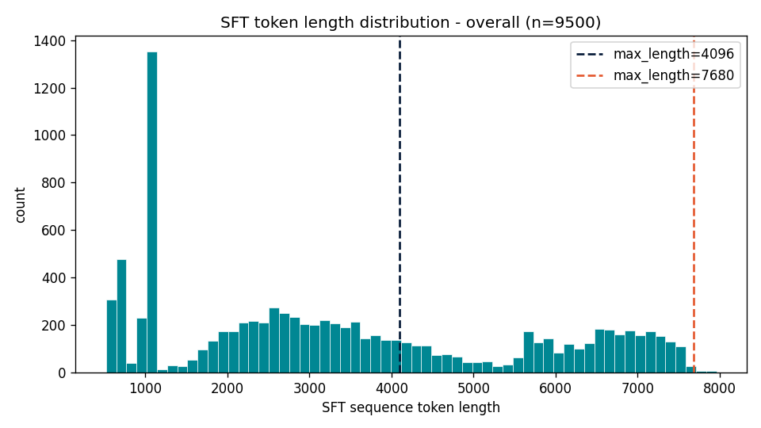
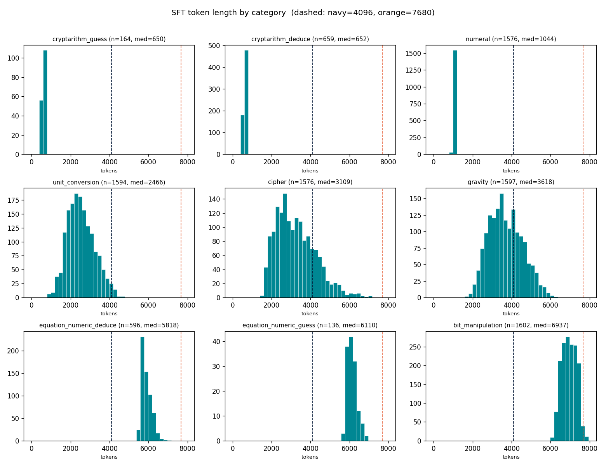

## 总览

| 阶段 | 描述 |
|---|---|
| 一、零样本推理基准 | 5 个模型直接推理，无微调 |
| 二、三组 LoRA 数据集对比 | 统一框架，对比 legacy / synthetic / low-quality 三组数据 |
| 三、LoRA 超参数搜索 | legacy CoT 数据，搜索 max\_length / batch / lr / r-alpha |

验证集：`current_950`，共 950 题。

---

## 一、评估设置

所有实验统一推理与评分参数：

| 参数 | 取值 |
|---|---|
| base model | Qwen3-30B-A3B（`./models/Qwen3-30B-A3B`） |
| vLLM max\_model\_len | 8,192 |
| vLLM gpu\_memory\_utilization | 0.85 |
| vLLM max\_lora\_rank | 32 |
| temperature / top\_p | 0.0 / 1.0 |
| max\_tokens（生成上限） | 7,680 |
| thinking mode | 启用（`enable_thinking=True`） |
| prompt suffix | `Please put your final answer inside \boxed{}. For example: \boxed{your answer}` |
| 答案抽取 | 优先 `\boxed{}`，兜底 `Final answer:`，最后落到末行 |
| 评分 | 01 串严格比 / 数值 1e-2 相对容忍 / 大小写不敏感字符串比 |

零样本实验使用旧框架（`scripts/generate_baseline.py`），推理参数 max\_tokens=32768，详见第二节。

---

## 二、零样本推理基准（Prompting Baselines）

### 2.1 推理配置

| 参数 | 取值 |
|---|---|
| 微调 | 无 |
| temperature / top\_p | 0.0 / 1.0 |
| max\_tokens | 32,768 |
| max\_model\_len | 32,768（Kimi 系列使用 37,760，满足 hybrid attention page-size 约束） |
| thinking mode | 启用 |
| 框架 | `scripts/generate_baseline.py` + `scripts/evaluate_baseline.py`（已归档） |

### 2.2 各模型 current\_950 结果

| category | Qwen3-30B-A3B | Qwen3-4B | Nemotron-30B-A3B | Kimi-48B-Instruct | Kimi-48B-Base |
|---|---:|---:|---:|---:|---:|
| bit\_manipulation | 26.2% (42/160) | 16.2% (26/160) | 25.0% (40/160) | 4.4% (7/160) | 6.9% (11/160) |
| cipher | 42.7% (67/157) | 4.5% (7/157) | 53.5% (84/157) | 1.9% (3/157) | 0.0% (0/157) |
| cryptarithm\_deduce | 3.0% (2/66) | 0.0% (0/66) | 0.0% (0/66)† | 0.0% (0/66) | 0.0% (0/66) |
| cryptarithm\_guess | 0.0% (0/16) | 0.0% (0/16) | 0.0% (0/16)† | 0.0% (0/16) | 0.0% (0/16) |
| equation\_numeric\_deduce | 53.3% (32/60) | 41.7% (25/60) | 45.0% (27/60) | 8.3% (5/60) | 15.0% (9/60) |
| equation\_numeric\_guess | 7.1% (1/14) | 7.1% (1/14) | 0.0% (0/14)† | 0.0% (0/14) | 0.0% (0/14) |
| gravity | 99.4% (159/160) | 99.4% (159/160) | 74.4% (119/160) | 6.9% (11/160) | 75.6% (121/160) |
| numeral | 100.0% (158/158) | 82.9% (131/158) | 100.0% (158/158) | 88.0% (139/158) | 75.9% (120/158) |
| unit\_conversion | 100.0% (159/159) | 95.0% (151/159) | 86.8% (138/159) | 15.1% (24/159) | 35.8% (57/159) |
| **TOTAL** | **65.3% (620/950)** | **52.6% (500/950)** | **59.6% (566/950)** | **19.9% (189/950)** | **33.5% (318/950)** |

† Nemotron 的 cryptarithm / equation\_guess 类别受 `finish_reason=length` 截断影响显著：
cryptarithm\_guess 截断率 100%，cryptarithm\_deduce 97%，bit\_manipulation 64%，
平均生成 13,225 tokens/题（Qwen3 约 12,879）。Kimi-Instruct 截断率更高达 71.5%（679/950 题）。

---

## 三、三组 LoRA 数据集对比

训练框架：Transformers Trainer + Unsloth 模型补丁（`scripts/train.py` + `src/training/runner.py`）。
评估日期：2026-08-11。设备：NVIDIA H200 单卡。

### 3.0 数据构建与训练复现

**Pipeline 架构：**

```text
legacy external CoT CSV ─┐
                         ├─> common tokenized JSONL ─> Transformers Trainer
synthetic generator/CoT ─┘       input_ids / attention_mask / labels
                                                    |
                                                    v
                                           Qwen3 LoRA adapters
                                                    |
                                                    v
                                             current_950
```

**构建训练数据：**

```bash
python scripts/build_data.py --config configs/data/legacy.yaml           # legacy CoT
python scripts/build_data.py --config configs/data/synthetic_pilot.yaml  # synthetic CoT
```

**训练（以 legacy 为例；复制 configs/training/legacy.yaml 并修改 experiment.name / paths）：**

```bash
python scripts/train.py --config configs/training/legacy.yaml
```

**评估矩阵（三个 adapter × current_950）：**

```bash
bash scripts/run_evaluation_matrix.sh \
  ./models/Qwen3-30B-A3B \
  outputs/adapters/legacy-cot-transformers \
  outputs/adapters/synthetic-cot-transformers \
  outputs/adapters/low-quality-cot \
  results/evaluation_matrix/qwen3-30b
```

### 3.1 共享训练配置

| 参数 | 取值 |
|---|---|
| base model | Qwen3-30B-A3B（`./models/Qwen3-30B-A3B`） |
| LoRA r / alpha / dropout | 16 / 32 / 0.0 |
| LoRA target\_modules | q\_proj, k\_proj, v\_proj, o\_proj（4 个，较 Phase 1 减少 gate/up/down） |
| max\_seq\_length | 8,192 |
| per\_device\_batch × grad\_accum | 1 × 4（eff\_batch=4） |
| learning\_rate | 2e-4 → 1e-5（cosine\_with\_min\_lr） |
| epochs | 1 |
| max\_grad\_norm | 1e9 |
| 精度 | bfloat16 |
| packing | 禁用 |
| completion-only labels | 是 |
| seed | 123 |

### 3.2 训练数据对比

| | legacy-cot | synthetic-cot | low-quality-cot |
|---|---|---|---|
| 文件 | data/train\_split\_with\_cot.csv | 由 `build_data.py` 生成 | data/train\_split\_low\_quality\_cot.csv |
| 来源 | 竞赛官方训练集 CoT | Nemotron 生成器 + 求解器验证 | 模板填充假 CoT（消融对照） |
| 行数 | 9,500 | 13,794 | 9,500 |
| CoT 质量 | external\_unverified | solver\_verified | template\_fabricated |
| avg tokens / avg loss tokens | 3,442 / 3,299 | 3,480 / 3,328 | 202 / 59 |
| 训练步数 | 2,375 | 3,449 | 2,375 |
| 训练时长 | 6.26 h | 8.53 h | 2.89 h |

**合成数据生成统计：**

| category | 生成数 | 验证通过 | 验证失败 |
|---|---:|---:|---:|
| bit\_manipulation | 4,000 | 3,942 | 58 |
| equation\_transform/numeric | 4,000 | 3,568 | 432 |
| equation\_transform/symbol | 4,000 | 2,784 | 1,216 |
| text\_cipher | 2,000 | 2,000 | 0 |
| physics\_gravity | 500 | 500 | 0 |
| unit\_conversion | 500 | 500 | 0 |
| roman\_numeral | 500 | 500 | 0 |
| **合计** | **15,500** | **13,794** | **1,706** |


**Legacy CoT token 长度分布（Qwen3-30B-A3B tokenizer，9,500 条完整 SFT 序列）：**





### 3.3 current\_950 结果

| category | legacy-cot | synthetic-cot | low-quality-cot |
|---|---:|---:|---:|
| bit\_manipulation | 80.6% (129/160) | **96.9% (155/160)** | 41.9% (67/160) |
| cipher | 100.0% (157/157) | 100.0% (157/157) | 73.9% (116/157) |
| cryptarithm\_deduce | 9.1% (6/66) | 12.1% (8/66) | 4.5% (3/66) |
| cryptarithm\_guess | 0.0% (0/16) | **12.5% (2/16)** | 0.0% (0/16) |
| equation\_numeric\_deduce | 90.0% (54/60) | **100.0% (60/60)** | 51.7% (31/60) |
| equation\_numeric\_guess | 7.1% (1/14) | **50.0% (7/14)** | 14.3% (2/14) |
| gravity | 100.0% (160/160) | 100.0% (160/160) | 81.9% (131/160) |
| numeral | 100.0% (158/158) | 100.0% (158/158) | 100.0% (158/158) |
| unit\_conversion | 100.0% (159/159) | 100.0% (159/159) | 100.0% (159/159) |
| **TOTAL** | **86.7% (824/950)** | **91.2% (866/950)** | **70.2% (667/950)** |

**结论**：
- synthetic CoT 比 legacy CoT 高 +4.5pp，核心提升来自 bit\_manipulation（+16.3pp）和 equation\_numeric\_guess（+42.9pp）。
- low-quality CoT 消融确认 CoT 质量是关键因素：模板填充假推理直接下降 16.5pp。
- cryptarithm 两类（deduce + guess）在所有配置下均属短板，最高仅 12.5%，是后续改进的主要方向。

---

## 四、LoRA 超参数搜索

所有 Phase 1 实验数据来源：`data/train_split_with_cot.csv`（legacy CoT，9,500 行）。
训练框架：Unsloth + TRL SFTTrainer（已归档脚本 `scripts/train_lora_unsloth.py`）。

### 4.1 共享基础配置

| 参数 | 取值 |
|---|---|
| base model | Qwen3-30B-A3B |
| 训练数据 | train\_split\_with\_cot.csv（9,500 行，external\_unverified CoT） |
| LoRA target\_modules | q\_proj, k\_proj, v\_proj, o\_proj, gate\_proj, up\_proj, down\_proj（7 个） |
| 精度 | bfloat16 |
| packing | 禁用 |
| completion-only labels | 是（prompt 和 padding 的 label 设为 −100） |
| Liger kernel | 启用 |
| epochs | 1 |
| max\_grad\_norm | 1e9 |
| 设备 | NVIDIA H200 单卡（lr 消融使用 B200） |

各消融实验的**默认值**（未变化的维度保持此值）：

| 参数 | 默认值 |
|---|---|
| max\_length（训练截断） | 7,680 |
| eff\_batch（per\_device=1） | 8（gradient\_accumulation=8） |
| learning\_rate | 2e-4 |
| LoRA r / alpha | 32 / 32 |

### 4.2 max\_length 消融

固定：eff\_batch=8，lr=2e-4，r=32，alpha=32。

| category | ml=4096 | ml=7680 | ml=8192 |
|---|---:|---:|---:|
| bit\_manipulation | 0.0% (0/160) | 81.9% (131/160) | 80.0% (128/160) |
| cipher | 99.4% (156/157) | 99.4% (156/157) | 98.7% (155/157) |
| cryptarithm\_deduce | 4.5% (3/66) | 6.1% (4/66) | 4.5% (3/66) |
| cryptarithm\_guess | 0.0% (0/16) | 0.0% (0/16) | 0.0% (0/16) |
| equation\_numeric\_deduce | 13.3% (8/60) | 90.0% (54/60) | 88.3% (53/60) |
| equation\_numeric\_guess | 0.0% (0/14) | 7.1% (1/14) | 7.1% (1/14) |
| gravity | 100.0% (160/160) | 100.0% (160/160) | 100.0% (160/160) |
| numeral | 100.0% (158/158) | 100.0% (158/158) | 100.0% (158/158) |
| unit\_conversion | 100.0% (159/159) | 100.0% (159/159) | 100.0% (159/159) |
| **TOTAL** | **67.8% (644/950)** | **86.6% (823/950)** | **86.0% (817/950)** |

**结论**：ml=4096 截断了全部 bit\_manipulation（中位 CoT 长度 6,937 tokens）和 equation\_numeric 样本，导致这两类完全失效；ml=7680 与 ml=8192 无显著差异，以 7680 作为后续实验基准。

### 4.3 batch size 消融

固定：ml=7680，lr=2e-4，r=32，alpha=32。

| category | eff\_batch=16 | eff\_batch=8 | eff\_batch=4 |
|---|---:|---:|---:|
| bit\_manipulation | 74.4% (119/160) | 80.0% (128/160) | 83.8% (134/160) |
| cipher | 100.0% (157/157) | 98.7% (155/157) | 99.4% (156/157) |
| cryptarithm\_deduce | 6.1% (4/66) | 6.1% (4/66) | 7.6% (5/66) |
| cryptarithm\_guess | 0.0% (0/16) | 0.0% (0/16) | 0.0% (0/16) |
| equation\_numeric\_deduce | 85.0% (51/60) | 88.3% (53/60) | 88.3% (53/60) |
| equation\_numeric\_guess | 0.0% (0/14) | 7.1% (1/14) | 7.1% (1/14) |
| gravity | 100.0% (160/160) | 100.0% (160/160) | 100.0% (160/160) |
| numeral | 100.0% (158/158) | 100.0% (158/158) | 100.0% (158/158) |
| unit\_conversion | 100.0% (159/159) | 100.0% (159/159) | 100.0% (159/159) |
| **TOTAL** | **85.1% (808/950)** | **86.1% (818/950)** | **86.9% (826/950)** |

**结论**：较小 batch 在 bit\_manipulation 上有小幅优势；差距在 1pp 以内，实践中以 eff\_batch=4 为宜。

### 4.4 learning rate 消融

固定：ml=7680，eff\_batch=8，r=32，alpha=32。设备：B200 单卡。

| category | lr=1e-4 | lr=2e-4 | lr=5e-4 |
|---|---:|---:|---:|
| bit\_manipulation | 77.5% (124/160) | 80.6% (129/160) | 80.6% (129/160) |
| cipher | 98.7% (155/157) | 99.4% (156/157) | 100.0% (157/157) |
| cryptarithm\_deduce | 6.1% (4/66) | 6.1% (4/66) | 9.1% (6/66) |
| cryptarithm\_guess | 0.0% (0/16) | 0.0% (0/16) | 0.0% (0/16) |
| equation\_numeric\_deduce | 86.7% (52/60) | 86.7% (52/60) | 91.7% (55/60) |
| equation\_numeric\_guess | 7.1% (1/14) | 7.1% (1/14) | 7.1% (1/14) |
| gravity | 99.4% (159/160) | 100.0% (160/160) | 100.0% (160/160) |
| numeral | 100.0% (158/158) | 100.0% (158/158) | 100.0% (158/158) |
| unit\_conversion | 100.0% (159/159) | 100.0% (159/159) | 100.0% (159/159) |
| **TOTAL** | **85.5% (812/950)** | **86.2% (819/950)** | **86.8% (825/950)** |

**结论**：lr=5e-4 略优，cryptarithm\_deduce 和 equation\_numeric\_deduce 有提升，差距约 0.6pp；三档学习率整体差异较小。

### 4.5 LoRA r / alpha 网格搜索

固定：ml=7680，eff\_batch=4，lr=2e-4，max\_grad\_norm=1e9。评估 max\_lora\_rank=64。
网格共 9 组（r × alpha ∈ {16, 32, 64}²）。

**TOTAL 准确率（行 = r，列 = alpha）：**

| r ＼ alpha | 16 | 32 | 64 |
|---|---:|---:|---:|
| **16** | 86.5% (822/950) | **87.1% (827/950)** | 86.9% (826/950) |
| **32** | 86.3% (820/950) | 86.9% (826/950) | **87.1% (827/950)** |
| **64** | 86.3% (820/950) | 86.1% (818/950) | 86.6% (823/950) |

**r=16 各类别明细：**

| category | alpha=16 | alpha=32 | alpha=64 |
|---|---:|---:|---:|
| bit\_manipulation | 81.9% (131/160) | 83.1% (133/160) | 83.8% (134/160) |
| cipher | 100.0% (157/157) | 100.0% (157/157) | 100.0% (157/157) |
| cryptarithm\_deduce | 4.5% (3/66) | 7.6% (5/66) | 7.6% (5/66) |
| cryptarithm\_guess | 0.0% (0/16) | 0.0% (0/16) | 0.0% (0/16) |
| equation\_numeric\_deduce | 88.3% (53/60) | 88.3% (53/60) | 86.7% (52/60) |
| equation\_numeric\_guess | 7.1% (1/14) | 14.3% (2/14) | 7.1% (1/14) |
| gravity | 100.0% (160/160) | 100.0% (160/160) | 100.0% (160/160) |
| numeral | 100.0% (158/158) | 100.0% (158/158) | 100.0% (158/158) |
| unit\_conversion | 100.0% (159/159) | 100.0% (159/159) | 100.0% (159/159) |
| **TOTAL** | **86.5% (822/950)** | **87.1% (827/950)** | **86.9% (826/950)** |

**r=32 各类别明细：**

| category | alpha=16 | alpha=32 | alpha=64 |
|---|---:|---:|---:|
| bit\_manipulation | 80.6% (129/160) | 83.8% (134/160) | 83.8% (134/160) |
| cipher | 99.4% (156/157) | 99.4% (156/157) | 100.0% (157/157) |
| cryptarithm\_deduce | 6.1% (4/66) | 7.6% (5/66) | 9.1% (6/66) |
| cryptarithm\_guess | 0.0% (0/16) | 0.0% (0/16) | 0.0% (0/16) |
| equation\_numeric\_deduce | 88.3% (53/60) | 88.3% (53/60) | 85.0% (51/60) |
| equation\_numeric\_guess | 7.1% (1/14) | 7.1% (1/14) | 14.3% (2/14) |
| gravity | 100.0% (160/160) | 100.0% (160/160) | 100.0% (160/160) |
| numeral | 100.0% (158/158) | 100.0% (158/158) | 100.0% (158/158) |
| unit\_conversion | 100.0% (159/159) | 100.0% (159/159) | 100.0% (159/159) |
| **TOTAL** | **86.3% (820/950)** | **86.9% (826/950)** | **87.1% (827/950)** |

**r=64 各类别明细：**

| category | alpha=16 | alpha=32 | alpha=64 |
|---|---:|---:|---:|
| bit\_manipulation | 80.6% (129/160) | 80.6% (129/160) | 81.9% (131/160) |
| cipher | 100.0% (157/157) | 98.7% (155/157) | 100.0% (157/157) |
| cryptarithm\_deduce | 6.1% (4/66) | 6.1% (4/66) | 7.6% (5/66) |
| cryptarithm\_guess | 0.0% (0/16) | 0.0% (0/16) | 0.0% (0/16) |
| equation\_numeric\_deduce | 86.7% (52/60) | 86.7% (52/60) | 86.7% (52/60) |
| equation\_numeric\_guess | 7.1% (1/14) | 7.1% (1/14) | 7.1% (1/14) |
| gravity | 100.0% (160/160) | 100.0% (160/160) | 100.0% (160/160) |
| numeral | 100.0% (158/158) | 100.0% (158/158) | 100.0% (158/158) |
| unit\_conversion | 100.0% (159/159) | 100.0% (159/159) | 100.0% (159/159) |
| **TOTAL** | **86.3% (820/950)** | **86.1% (818/950)** | **86.6% (823/950)** |

**结论**：r=16/alpha=32 与 r=32/alpha=64 并列最优（87.1%），r 更大带来参数量增加但收益递减；r=16 以更少参数达到同等效果，Phase 2 采用 r=16/alpha=32。

---
